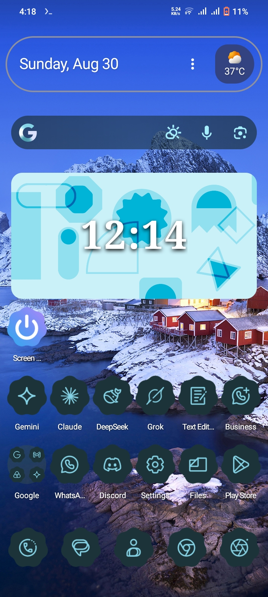
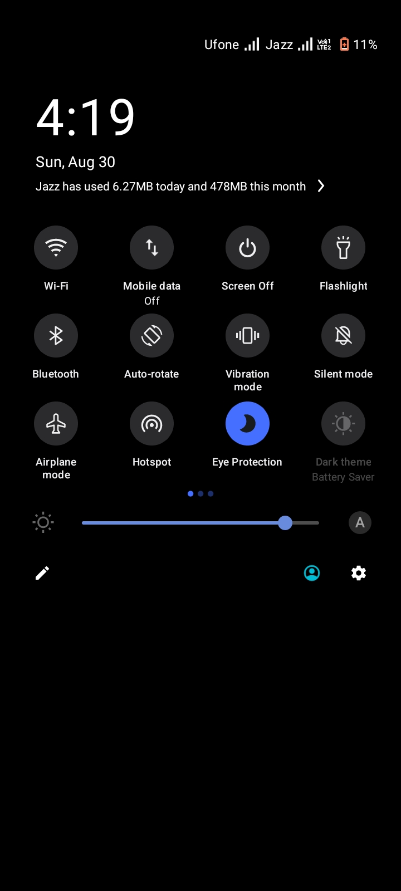
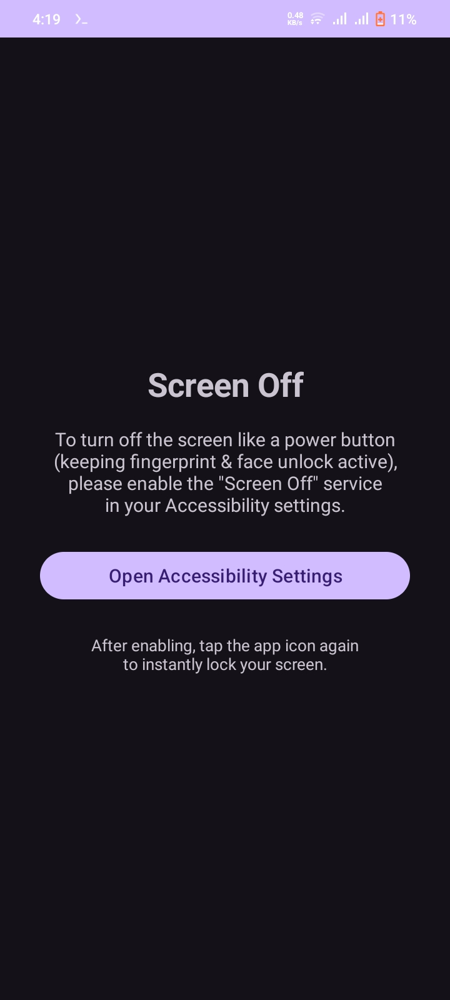
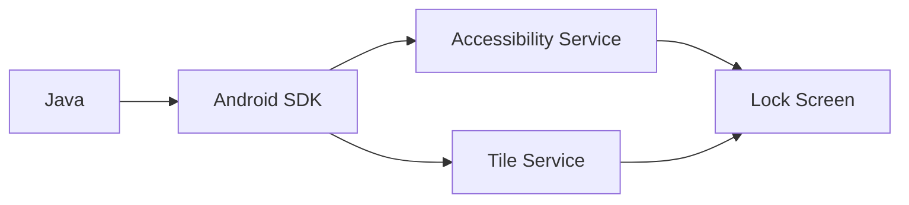

<div align="center">
  
  
  
  
  
</div>

<br>

<div align="center">
  <h1>📱 Screen Off</h1>
  <p><strong>Your physical power button's new best friend.</strong></p>
  <p>One tap to lock your screen. No root required. No ads. Pure utility.</p>
</div>

<br>

## ✨ Features

| Feature | Description |
| :--- | :--- |
| 🔒 **One-Tap Lock** | Lock your screen instantly using Android's Accessibility API. |
| 🧩 **Quick Settings Tile** | Add a tile to your notification shade for lightning-fast access. |
| 🚀 **Lightweight** | Under 500KB – built for performance, not bloat. |
| 🛡️ **Privacy First** | No internet permissions. No data collection. 100% offline. |
| 📱 **Material You** | Seamlessly fits your Android 12+ dynamic color theme. |

<br>

## 📸 Screenshots


<div align="center">
  
  
  
</div>

<br>

## 🛠️ Tech Stack



Technology Version
Language Java 8+
Min SDK API 21 (Android 5.0 Lollipop)
Target SDK API 33 (Android 13)
Build Tool Gradle 8.4
Architecture MVVM (Lightweight)

<br>

📥 Download & Install

Get the latest APK directly from the Releases section:

<div align="center">
  <a href="https://github.com/wized2/screen-off/releases/latest">
    
  </a>
</div>

Installation Steps:

1. Download the app-debug.apk from the latest release.
2. Open the file on your Android device.
3. Allow "Install from unknown sources" if prompted.
4. Open the app → Grant Accessibility Permission → Done!

<br>

🏗️ Build from Source

Want to tinker with the code? Build it yourself in 3 commands:

```bash
# 1. Clone the repository
git clone https://github.com/wized2/screen-off.git

# 2. Navigate to the folder
cd screen-off

# 3. Build the debug APK
./gradlew assembleDebug
```

The APK will be generated at: app/build/outputs/apk/debug/

<br>

🤝 Contributing

Found a bug or have a feature request? Open an issue! Pull requests are welcome and appreciated.

1. Fork the project.
2. Create your feature branch (git checkout -b feature/AmazingFeature).
3. Commit your changes (git commit -m 'Add some amazing feature').
4. Push to the branch (git push origin feature/AmazingFeature).
5. Open a Pull Request.

<br>

📄 License

Distributed under the Apache License 2.0. See the LICENSE file for more information.

```
Copyright 2026 wized2

Licensed under the Apache License, Version 2.0 (the "License");
you may not use this file except in compliance with the License.
You may obtain a copy of the License at

    http://www.apache.org/licenses/LICENSE-2.0
```

<br>

<div align="center">
  <sub>Built with ❤️ for the open-source community.</sub>
</div>
